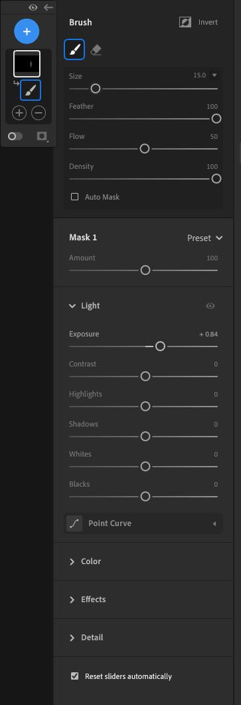
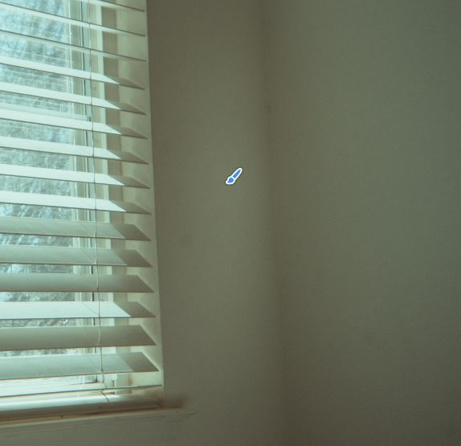
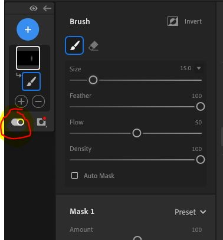
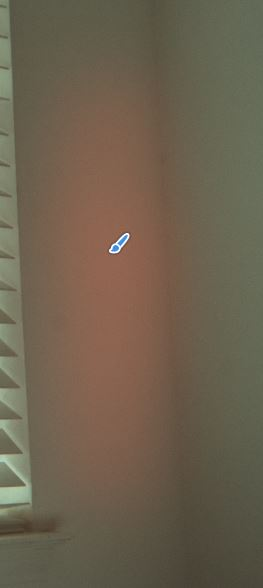

## Lightroom Masking Tool

Giovanni DiSalvo, March 15 2024

I use [Adobe's Lightroom](https://en.wikipedia.org/wiki/Adobe_Lightroom) to upload and edit photos. One of the great features of Lightroom is to be able to mask a certain part of the image using the built-in masking feature which allows you to make adjustments to one part of the photo, rather than the whole photo.

In Lightroom the way that it works is to create a mask using a brush, you use a brush and can decrease/increase the feather of said brush, and increase/decrease the hardness of the mask being applied. Now this is the simple way of using the masking tools, there are new ways such as using artificial intelligence to automatically mask an object or area in which you select, but I am strictly looking at the standard way of creating a mask.

Here is what the mask menu looks like.
 

 

Now it is common when I am trying to brush on a light mask I can’t see where the mask is being applied to unless I select it or even change the exposure of the mask dramatically to see where it is. Now this is where we can demonstrate an application of **“Matching between system and the real world”** , which is a [usability guidline](https://www.nngroup.com/articles/ten-usability-heuristics/) for using concepts in the real world that helps us make interfaces **learnable**.

 

 

An example here is a mask I created, but you really can’t tell at all which area of the photo the mask is covering. So here we are experiencing a bad example of **recognition rather than recall**. Where I have to use a lot of memory to remember exactly where I ran my brush over because elements such as the area of my mask aren’t visible.

 

 

Now this was a big annoyance I had with the software so I went on to Google and found a YouTube tutorial that described a bunch of shortcuts and one that gave me the exact answer I was looking for. You can reveal the area in which the mask covers the image by pressing “O” What this does is it reveals the area of which the mask is covering making it red, and easy to make out. As we can tell from the first image, there isn’t anything that makes that clear in terms of the options of the mask.

The highlighted toggle button also does the same trick as the shortcut, but it should be much clearer what this toggle button does. I suggest maybe extending that bar a little bit just to give small text or clues as to what the toggle does.

Highlighted mask:
 

 

